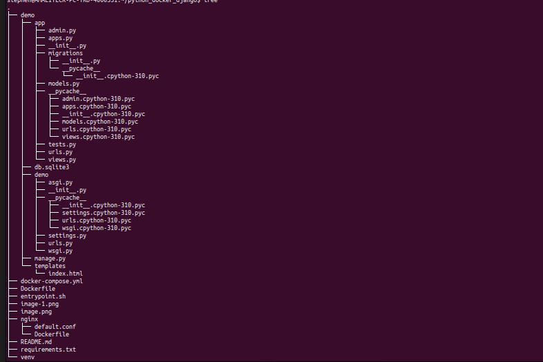
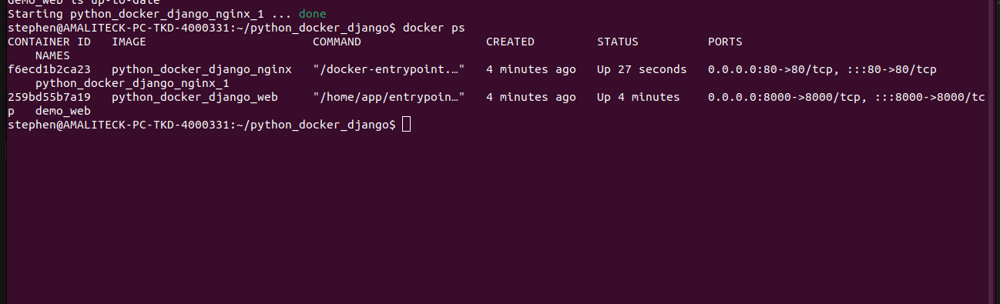

# Django Web Server in Docker
This repository contains a simple Django web server packaged into a Docker container. Follow the steps below to build the Docker image and run the container locally.

## Prerequisites

Ensure the following are installed on your system:

Python 3.x

Docker

Docker Compose

## Project Structure


1. **Clone the Repository:**
   ```bash
    https://github.com/BINAH25/python_docker_django
    cd python_docker_django

2. **Create Virtual Environment:**
   ```bash
   python -m venv venv
   source venv/bin/activate  # On Windows, use `venv\Scripts\activate`

3. **Install the requires dependencies:**
   ```bash
   pip3 install -r requirements.txt

4. **Start the Containers in Detached Mode:**
   ```bash
    docker-compose up -d

    This will:
    Build the images (if not already built).
    Start the containers in detached mode.

5. **Check Running Containers**

    ```bash
        docker ps
    This will list all active containers along with their port mappings.

    

6. **Visit http://127.0.0.1:80**
    this will display the below page
    